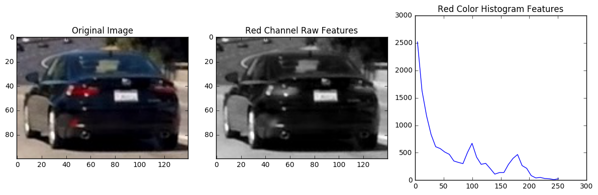
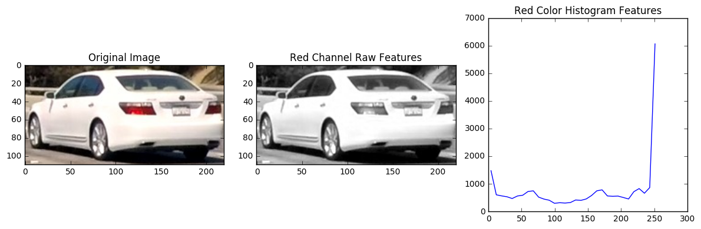
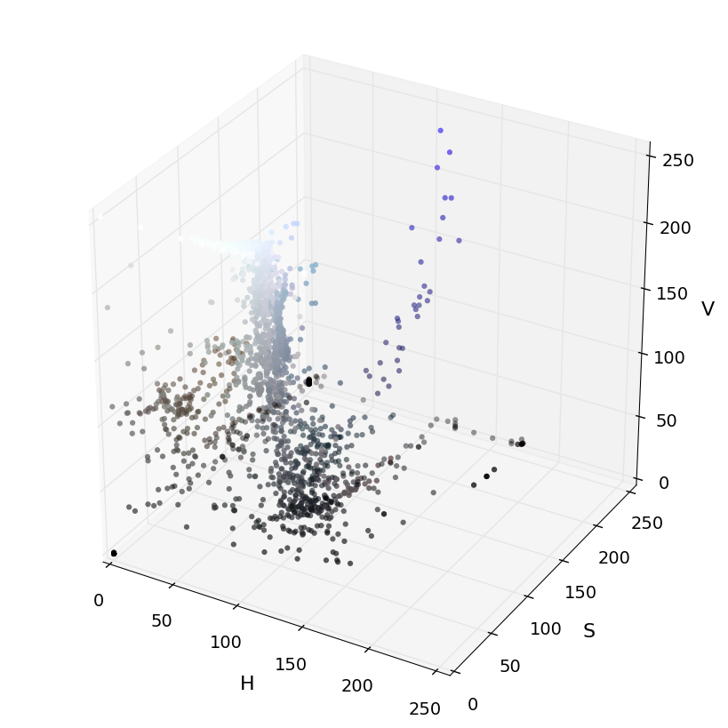
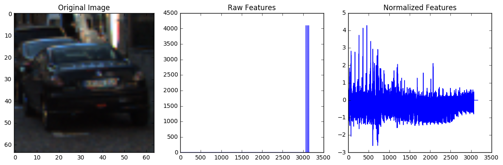
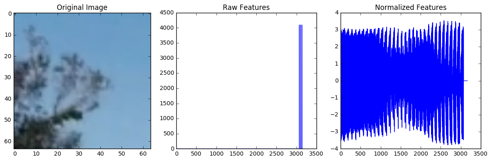
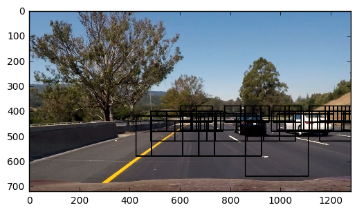
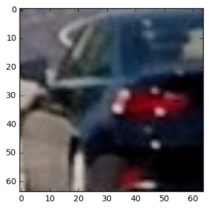

# Vehicle-Detection-Tracking 
Udacity Self-Driving Car Engineer Class Project, due on Feb 27th, 2017

**Vehicle Detection Project**

The goals / steps of this project are the following:

In this project, the goal is to write a software pipeline to detect vehicles in a provided video. 

* Perform a Histogram of Oriented Gradients (HOG) feature extraction on a labeled training set of images and train a classifier Linear SVM classifier
* Optionally, you can also apply a color transform and append binned color features, as well as histograms of color, to your HOG feature vector. 
* Note: for those first two steps don't forget to normalize your features and randomize a selection for training and testing.
* Implement a sliding-window technique and use your trained classifier to search for vehicles in images.
* Run your pipeline on a video stream (start with the test_video.mp4 and later implement on full project_video.mp4) and create a heat map of recurring detections frame by frame to reject outliers and follow detected vehicles.
* Estimate a bounding box for vehicles detected.

[//]: # (Image References)
[image1]: ./examples/car_not_car.png
[image2]: ./examples/HOG_example.jpg
[image3]: ./examples/sliding_windows.jpg
[image4]: ./examples/sliding_window.jpg
[image5]: ./examples/bboxes_and_heat.png
[image6]: ./examples/labels_map.png
[image7]: ./examples/output_bboxes.png
[video1]: ./project_video.mp4

## [Rubric](https://review.udacity.com/#!/rubrics/513/view) Points
###Here I will consider the rubric points individually and describe how I addressed each point in my implementation.  

---
###Writeup / README

####1. Provide a Writeup / README that includes all the rubric points and how you addressed each one.  You can submit your writeup as markdown or pdf.  [Here](https://github.com/udacity/CarND-Vehicle-Detection/blob/master/writeup_template.md) is a template writeup for this project you can use as a guide and a starting point.  

First of all, I break down the project into small sections, and each section is independent, we can deep dive into it later, but it also follow the process flow:
* Calibarate the Camera
* Experience the behivours of each technique
* Combin some techniques together
* Builded Classifers (HOG and color, and Neural Network)
* Random Slide Windows
* Combin different Classifers
* Increase Processing Speed FPS
* Markup the bounding box
* Pipeline process for the video

### Calibarate the Camera
Since this project is the following project after project 4, and it is not focus on this task, so I just carry over the method and files from project 4. I resized the video frame from 1280x720 to 720x405. I hope can increase some process speed. Also, the calibarate matrix and resolution has to match.  
```
# Reload the camera calibration matrix and distortion conefficients 
scale = 720/1280 # Scale the 1280 image down to 720 image
nx = 9 # the number of inside corners in x
ny = 6 # the number of inside corners in y

# These are the arrays you calculated using cv2.calibrateCamera()
dist_pickle = pickle.load( open( "camera_cal/720x540_cal_pickle.p", "rb" ) )
mtx = dist_pickle["mtx"]
dist = dist_pickle["dist"]
```
The calibration matrix and distortion comefficient are reloaded from pickle file. 
I builded a class process that include the openCV cv2.undistort as a function. 
```
def undist(self):
        self.undist = cv2.undistort(self.resize(), self.mtx, self.dist, None, self.mtx)
        return self.undist
```
<p align="center">
 
</p>

###Histogram of Oriented Gradients (HOG)

####1. Explain how (and identify where in your code) you extracted HOG features from the training images.

The code in the Jupyter notebook `Building_classifier.ipynb` will follow the order of this writeup. I will explain each code cell and the results.   

First, I read in a test image, cutout the black car and the white car. Then apply
```
# Read in test image
image = mpimg.imread('./test_images/test1.jpg')
cutout = image[400:500, 810:950]    # Black Car 
#cutout = image[400:510, 1050:1270]   # White Car

bins_range = (0,255)
red= cutout[:,:,0]
rhist = np.histogram(red, bins = 32, range=bins_range, normed = False )
bin_edges = rhist[1]
bin_centers = (bin_edges[1:]  + bin_edges[0:len(bin_edges)-1])/2
```
<p align="center">
 
</p>
<p align="center">
 
</p>
We can see the two histograms from white car and black car appear totally different, therefore, these are good features to recognize these two different color of cars. 

I then explored different color spaces by following Udacity lessens code:
```
# apply color conversion if other than 'RGB'
        if cspace != 'RGB':
            if cspace == 'HSV':
                feature_image = cv2.cvtColor(image, cv2.COLOR_RGB2HSV)
            elif cspace == 'LUV':
                feature_image = cv2.cvtColor(image, cv2.COLOR_RGB2LUV)
            elif cspace == 'HLS':
                feature_image = cv2.cvtColor(image, cv2.COLOR_RGB2HLS)
            elif cspace == 'YUV':
                feature_image = cv2.cvtColor(image, cv2.COLOR_RGB2YUV)
            elif cspace == 'YCrCb':
                feature_image = cv2.cvtColor(image, cv2.COLOR_RGB2YCrCb)
```
<p align="center">
 
</p>

I started by reading in all the `vehicle` and `non-vehicle` images.  Here is an example of one of each of the `vehicle` and `non-vehicle` classes:
```
# Read in car and non-car images
cars = glob.glob('./vehicles/*/*.png')
notcars = glob.glob('./non-vehicles/*/*.png')
```
The 3d plot may not show some meaningful information, but the following YCrCb color space histograms will be good enough to separe car or not car. This code does not include the HOG feature yet. 
```
car_features_YCrCb = extract_features(cars, cspace='YCrCb', spatial_size=(32, 32),
                        hist_bins=32, hist_range=(0, 256))
notcar_features_YCrCb = extract_features(notcars, cspace='YCrCb', spatial_size=(32, 32),
                        hist_bins=32, hist_range=(0, 256))
```
<p align="center">
 
</p>
<p align="center">
 
</p>
Another importent trick is normalize the features. As above pictures shown, the Raw feature only show you three bars, other bars values are too weak to show up. I am using StandardScaler().Fit(X) and transform() function as per the Udacity lessons the scale up all features samples from cars and notcars datasets.
```
# Create an array stack of feature vectors
    X = np.vstack((car_features_RGB, notcar_features_RGB)).astype(np.float64)                        
    # Fit a per-column scaler
    X_scaler = StandardScaler().fit(X)
    # Apply the scaler to X
    scaled_X = X_scaler.transform(X)
```

I then explored different color spaces and different `skimage.hog()` parameters (`orientations`, `pixels_per_cell`, and `cells_per_block`). HOG feature is an expensive function. It tooks:
```
37.76 Seconds to extract HOG features...
Using: 9 orientations 8 pixels per cell and 2 cells per block
Feature vector length: 1764
11.68 Seconds to train SVC...
Test Accuracy of SVC =  0.9391
My SVC predicts:  [ 1.  0.  0.  0.  1.  1.  1.  0.  1.  0.]
For these 10 labels:  [ 1.  0.  0.  0.  1.  1.  1.  0.  1.  0.]
0.00405 Seconds to predict 10 labels with SVC
```
For the given dataset, 8000+ cars images and 8000+ notcar images, the accuracy can reach 93.91%. I am looking for higher accuracy. So how about add all color histograms and HOG feature together. 
```
spatial_features = bin_spatial(feature_image, size=spatial_size)
file_features.append(spatial_features)

# Apply color_hist()
hist_features = color_hist(feature_image, nbins=hist_bins)
file_features.append(hist_features)

hog_features = get_hog_features(feature_image[:,:,hog_channel], orient, 
                            pix_per_cell, cell_per_block, vis=False, feature_vec=True)
# Append the new feature vector to the features list
file_features.append(hog_features)

features.append(np.concatenate(file_features))
```
This time, it take 3 times longer to extract features and training, but it take same time to predicts a label, and accuracy reached 99.03%, I am happy with this result.    
```
124.46 Seconds to extract HOG features...
Using: 8 orientations 7 pixels per cell and 2 cells per block
Feature vector length: 9312
38.12 Seconds to train SVC...
Test Accuracy of SVC =  0.9903
My SVC predicts:  [ 1.  0.  1.  0.  0.  0.  0.  0.  1.  0.]
For these 10 labels:  [ 1.  0.  1.  0.  0.  0.  0.  0.  1.  0.]
0.004 Seconds to predict 10 labels with SVC
```

####2. Explain how you settled on your final choice of HOG parameters.

I tried various combinations of parameters and here is a table shows the using the different color space and HOG parameters of `orientations=8`, `pixels_per_cell=(8, 8)` and `cells_per_block=(2, 2)` and  `hog_channel = 0, 1,2,All` and accuracies:

| Option | Color Space | Orientations | Pixels_per_cell | Cells_per_block | HOG channel | Accuracy |
|:-----:|:-------:|:-------:|:-------:|:-------:|:-------:|--------:|--------:|
| 0   |     | 9 | 8 | 2 | 0   | 0.9391 |
| 1   | RGB | 9 | 8 | 2 | 0   | 0.9750 |
| 2   | YUV | 9 | 8 | 2 | 0   | 0.9800   |
| 3   | YUV | 8 | 7 | 2 | All | 0.9904   |
| 4   | YCrCb | 8 | 7 | 2 | All | 0.9903 |

I choose the option 4 use 'YCrCb' color histogram, and `orientations=8`, `pixels_per_cell=(7, 7)` and `cells_per_block=(2, 2)` and 'All' hog channels simply because it yields highest accuracies 99.03%, which is much higher than simple Nerual Network can achive. 

####3. Describe how (and identify where in your code) you trained a classifier using your selected HOG features (and color features if you used them).

I trained a linear SVM using Udacity provided Vehicle and not-Vehicle dataset. I also make a class Params(): to store all feature settings.  
```
class Params():
    def __init__(
        self, 
        colorspace='YCrBr',
        orient=9,
        pix_per_cell=4, 
        cell_per_block=4, 
        hog_channel='ALL',
        spatial_size=(32, 32),
        hist_bins=32,
        spatial_feat=True,
        hist_feat=True,
        hog_feat=True
    ):
        self.colorspace = colorspace # Can be RGB, HSV, LUV, HLS, YUV, YCrCb
        self.orient = orient # typically between 6 and 12
        self.pix_per_cell = pix_per_cell # HOG pixels per cell
        self.cell_per_block = cell_per_block # HOG cells per block
        self.hog_channel = hog_channel # Can be 0, 1, 2, or "ALL"
        self.spatial_size = spatial_size # Spatial binning dimensions
        self.hist_bins = hist_bins # Number of histogram bins
        self.spatial_feat = spatial_feat # Spatial features on or off
        self.hist_feat = hist_feat # Histogram features on or off
        self.hog_feat = hog_feat  # HOG features on or off
```
The training process includes: 
* Extract both Vehicle and Not_Vehicle dataset with lables

```
car_features = extract_features(cars, color_space=params.colorspace, orient=params.orient, 
                        pix_per_cell=params.pix_per_cell, cell_per_block=params.cell_per_block, 
                        hog_channel=params.hog_channel)
notcar_features = extract_features(notcars, color_space=params.colorspace, orient=params.orient, 
                        pix_per_cell=params.pix_per_cell, cell_per_block=params.cell_per_block, 
                        hog_channel=params.hog_channel)
```
* Scale and Normalize the data
```
# Create an array stack of feature vectors
X = np.vstack((car_features, notcar_features)).astype(np.float64)                        
# Fit a per-column scaler
X_scaler = StandardScaler().fit(X)
# Apply the scaler to X
scaled_X = X_scaler.transform(X)
```
* Split the data into 80% for training, 20% for testing.
```
# Define the labels vector
y = np.hstack((np.ones(len(car_features)), np.zeros(len(notcar_features))))

# Split up data into randomized training and test sets
rand_state = np.random.randint(0, 100)
X_train, X_test, y_train, y_test = train_test_split(
    scaled_X, y, test_size=0.2, random_state=rand_state)

print('Using:', params.orient,'orientations',params.pix_per_cell,
    'pixels per cell and', params.cell_per_block,'cells per block')
```
* Traing the classifier with training data and label

```
print('Feature vector length:', len(X_train[0]))

# Use a linear SVC 
svc = LinearSVC()
# Check the training time for the SVC
t=time.time()
svc.fit(X_train, y_train)
t2 = time.time()
print(round(t2-t, 2), 'Seconds to train SVC...')
```
* Check the prediction
```
# Check the score of the SVC
print('Test Accuracy of SVC = ', round(svc.score(X_test, y_test), 4))
# Check the prediction time for a single sample
t=time.time()
```
I also built and trained a simple Nerual Network in Keras:
The data preparation is same as above. 
* Start with a Nerual Network model
```
from keras.models import Sequential
from keras.layers import Dense, Dropout, Activation, Flatten,Lambda
from keras.layers import Convolution2D, MaxPooling2D
from keras.utils import np_utils
from keras import backend as K


def get_conv(input_shape=(64,64,3), filename=None):
    model = Sequential()
    model.add(Lambda(lambda x: x/127.5 - 1.,input_shape=input_shape, output_shape=input_shape))
    model.add(Convolution2D(10, 3, 3, activation='relu', name='conv1',input_shape=input_shape, border_mode="same"))
    model.add(Convolution2D(10, 3, 3, activation='relu', name='conv2',border_mode="same"))
    model.add(MaxPooling2D(pool_size=(8,8)))
    model.add(Dropout(0.25))
    model.add(Convolution2D(128,8,8,activation="relu",name="dense1")) # This was Dense(128)
    model.add(Dropout(0.5))
    model.add(Convolution2D(1,1,1,name="dense2", activation="tanh")) # This was Dense(1)
    if filename:
        model.load_weights(filename)        
    return model

model = get_conv()
model.add(Flatten())
model.compile(loss='mse',optimizer='adadelta',metrics=['accuracy'])
```
* Train the Neural Network, and save the weights for futher use
```
model.fit(X_train, Y_train, batch_size=128, nb_epoch=20, verbose=1, validation_data=(X_test, Y_test))
score = model.evaluate(X_test, Y_test, verbose=0)
print('Test score:', score[0])
print('Test accuracy:', score[1])
model.save_weights("localize.h5")
```
* Check the Prediction and Search
```
heatmodel = get_conv(input_shape=(None,None,3), filename="localize.h5")
```
The Neural Network function is actually finding the location of the input image if it is a car. 
* Convert the output into heatmap
```
def locate(img, windows = None):
    
    heatmap = heatmodel.predict(img.reshape(1,img.shape[0],img.shape[1],img.shape[2]))
    
    location = []
    
    xx, yy = np.meshgrid(np.arange(heatmap.shape[2]),np.arange(heatmap.shape[1]))
    x = (xx[heatmap[0,:,:,0]>0.99])
    y = (yy[heatmap[0,:,:,0]>0.99])
        
    # Draw the box onto the blank image
    map_zero = np.zeros_like(img).astype(np.uint8)
    if len(windows) != 0:
        for win in windows:
            x1, y1, x2, y2 = win[0][0], win[0][1], win[1][0], win[1][1]
            for i,j in zip(x,y):
                # detection window within search windows
                if min(x1,x2)< i*8+32 < max(x1,x2) and min(y1,y2)< j*8+32<max(y1,y2):
                    cv2.rectangle(map_zero, (i*8,j*8), (i*8+64,j*8+64), (0,0,255), 1)
                    location.append(([i*8,j*8],[i*8+64, j*8+64]))
    return map_zero, location
```
<p align="center">
 
</p>
I also implemented a detection window within search windows search. If the center of detected object with in the pre-defined search window, return the results. This step can eliminate lot of unwanted results, such as false positive results. 

###Sliding Window Search

####1. Describe how (and identify where in your code) you implemented a sliding window search.  How did you decide what scales to search and how much to overlap windows?

I decided to search random window positions at certain scales over certain areas. I used the basic function in Udacity lesson
as base
```
def slide_window(img, x_start_stop=[None, None], y_start_stop=[None, None], 
                    xy_window=(64, 64), xy_overlap=(0.5, 0.5)):
```
added new function to call the slide_window(). I set three regions, far, middle, and near. By dauft, get 10 64x64 windows in far region(x> 600 pix, y in between 380 to 500 pix), get another 5 128x80 windows in middle region (x > 450 pix, y in between 400 to 550 pix). Also the near field, get 3 250x160 windows, area x > 300 pix, y in between 420 to 700 pix. Middle region and far region will overlop from the y in between 400 to 500 pix area. Middle region and near region will overlap from the y in between 420 to 550 pix. 
All scan boxes will randomly appeared in their region, and returned as a list of different scaled boxes location coordinates. 
```
def random_scan_boxes(image, far = 10, mid = 5, near = 3):
    #Create a list to append scan window coordinates
    scan_windows = []
    w_far = slide_window(image, x_start_stop=[600, None], y_start_stop=[380, 500], \
                         xy_window=(64,64), xy_overlap=(0.75, 0.5))
    for i in range (far):
        f = np.random.randint(0, len(w_far))
        scan_windows.append(w_far[f])
        #window_img = draw_boxes(image, windows, color=(0, 255, 255), thick=6)                    

    w_mid = slide_window(image, x_start_stop=[450, None], y_start_stop=[400, 550], \
                         xy_window=(128,80), xy_overlap=(0.75, 0.5))
    for i in range (mid):
        m = np.random.randint(0, len(w_mid))
        scan_windows.append(w_mid[m])
    
        #window_m_img = draw_boxes(window_img, window_m, color=(255, 255, 255), thick=6)                    

    w_near = slide_window(image, x_start_stop=[300, None], y_start_stop=[420, 700], \
                          xy_window=(250,160), xy_overlap=(0.75, 0.5))
    for i in range (near):
        n = np.random.randint(0, len(w_near))
        scan_windows.append(w_near[n])
        
    return scan_windows
```
The scan boxes can be used to build car finder pipeline as showing. It dependent on you needs to choose how many boxes for each region. More boxes, the random distribution is more even, but take longer to calculated. Less boxes, the detection output is flicking, I solved this problem in the following section. 
```
def car_finder_pipeline(img):
    t=time.time()
    image = img.astype(np.float32)/255 #Normalize .jpg image from 0-255 to 0-1
    
    boxes = random_scan_boxes(image, far = 40, mid = 20, near = 10)
    ... ...
```
<p align="center">
 
</p>


####2. Show some examples of test images to demonstrate how your pipeline is working.  What did you do to optimize the performance of your classifier?

Ultimately I searched on three scales using YCrCb 3-channel HOG features plus spatially binned color and histograms of color in the feature vector, which provided a nice result.  There are some example images:
* Crop out the car
<p align="center">
 
</p>
* Locate the car on input image and on heatmap
<p align="center">
 
</p>
* Multi cars detection
<p align="center">
 
</p>


### Video Implementation

####1. Provide a link to your final video output.  Your pipeline should perform reasonably well on the entire project video (somewhat wobbly or unstable bounding boxes are ok as long as you are identifying the vehicles most of the time with minimal false positives.)
Here's a [link to my video result](./project_video_out35.mp4)


####2. Describe how (and identify where in your code) you implemented some kind of filter for false positives and some method for combining overlapping bounding boxes.

I recorded the positions of positive detections in each frame of the video, globalize the positions and shared with other functions. 
```
global location, find_car_boxes, labeled_bboxes

print (find_car_boxes)
print (labeled_bboxes)
[(1, ((1192, 392), (1279, 480))), (2, ((760, 400), (872, 488)))]
[(1, ((1192, 392), (1279, 480))), (2, ((760, 400), (872, 488)))]
```
I created a blank image to draw heatmap. For every positive detections, added one layer of none-zeros to the heatmap. If there are many false detections, the hot spot may not hot enough. If the sliding window overlap is enough, and have consistent detections, the hot spot could be really hot. `Apply_threshold` to the heatmap is to remove some false detections that appear in one slide window, but not in other windows. 
```
heat = np.zeros_like(img[:,:,0]).astype(np.float)
heat = add_heat(heat, location)
# Apply threshold to help remove false positives
heat = apply_threshold(heat,1.5)
```
I then used `scipy.ndimage.measurements.label()` to identify individual blobs in the heatmap.  I then assumed each blob corresponded to a vehicle.  I constructed bounding boxes to cover the area of each blob detected.
```
# Find final boxes from heatmap using label function
labels = label(heatmap_NN)
draw_img = draw_labeled_bboxes(np.copy(image), labels)
```
<p align="center">
 
</p>


Here's an example result showing the heatmap with labels from a test image, the result of `scipy.ndimage.measurements.label()` and the bounding boxes with other information(such as estimated distances):
<p align="center">
 
</p>

###Discussion

####1. Briefly discuss any problems / issues you faced in your implementation of this project.  Where will your pipeline likely fail?  What could you do to make it more robust?

Vehicle detection should be happened in realy time. I think the ideal frame rate should be 20-30 fps. On the slow side, I may accepte 2-10 fps. Accuracy is very important too. I targeted the accuracy to be half car. The bonding box should not drop a half car. Missing detection and False positive detection both are bad, I targeted no missing detection in 10 frames, or give 0.5 second, and no false positive above driveable surface. Precision, consisent is always pair with accuracy, I expect the bonding box fit to the car with in 32 pixels. In this project, up coming traffic and left side traffic is not count, but my code can detect them as well. I'll talk about the approach I took, what techniques I used, what worked and why, where the pipeline might fail and how I might improve it if I were going to pursue this project further.

| Technique | Speed | Accuracy | Precision | Missing | False Positive | Filter | Comments |
|:---------:|:-----:|:--------:|:---------:|:-------:|:--------------:|:------:|:--------:|
| HOG-All   | 2 fps | 99%      | half car  |         |                |        |need scale the input|
| 1   | RGB | 9 | 8 | 2 | 0   | 0.9750 |
| 2   | YUV | 9 | 8 | 2 | 0   | 0.9800   |
| 3   | YUV | 8 | 7 | 2 | All | 0.9904   |
| 4   | YCrCb | 8 | 7 | 2 | All | 0.9903 |


### Credit to 
https://github.com/matthewzimmer/CarND-Vehicle-Detection-P5/blob/master/final-project.ipynb
